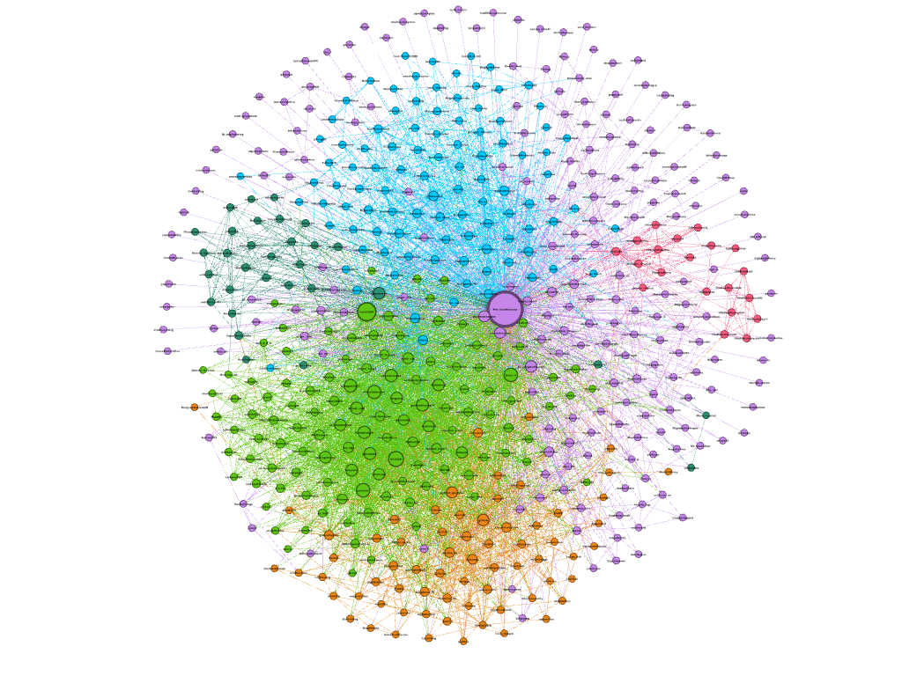

# TwitterFriends


------
Django app that makes a graph dataset with your friends on twitter, on GDF format.

This app saves information about you, all people you follow on Twitter and all people they follow using [Tweepy](https://github.com/tweepy/tweepy). This data is used to make a social graph in which you can study relationships between your friends on Twitter.

For example, my social graph, made on Gephi, is:



## How to use

Once you've cloned the repository, follow these steps to make your own Twitter friends graph:

1. Create a Twitter App on the [Twitter Apps Site](https://apps.twitter.com/)

2. Save your keys as __environment variables__:

  ```
  $ export TWITTER_CONSUMER_KEY=your_twitter_consumer_key
  $ export TWITTER_CONSUMER_SECRET=your_twitter_consumer_secret
  $ export TWITTER_ACCESS_TOKEN=your_twitter_access_token
  $ export TWITTER_ACCESS_TOKEN_SECRET=your_twitter_access_token_secret
  ```

3. Migrate the Django database. You must be on the same directory as `manage.py` file:

  ```
  $ cd TwitterFriends/
  $ python manage.py migrate
  ```

4. Once you've done the migration, run the script `save_friends.py` to start saving users from Twitter. This step may take a long time, it depends on how big your Twitter Network is.

  ```
  python save_friends.py
  ```

5. Once you've saved all users (friends and friends of your friends) it's time to create relationships between the users.

  ```
  python create_friendships.py
  ```

6. At this step, we have all data we need. Now let's export the data. Run the server:

  ```
  python manage.py runserver
  ```

7. Open `http://127.0.0.1:8000/` in your browser.

8. Download the network on the format you wish.
